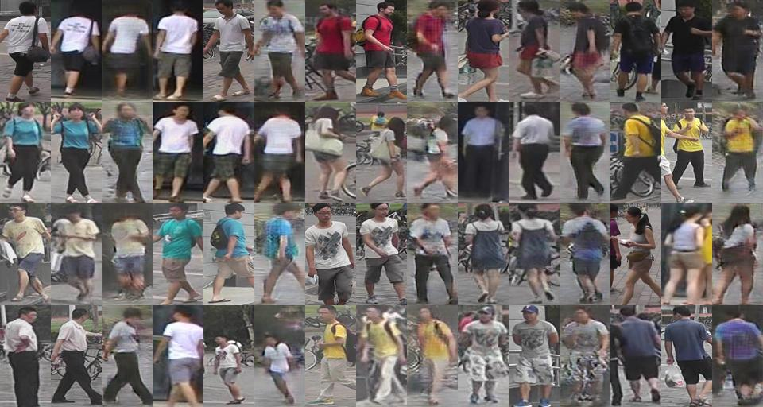

# Human Pose Transfer

## Implemented paper

- [x] [Pose Guided Person Image Generation](http://arxiv.org/abs/1705.09368) (NIPS2017)
- [ ] [Disentangled Person Image Generation](http://arxiv.org/abs/1712.02621) (CVPR2018 Spotlight)
- [ ] [Progressive Pose Attention Transfer for Person Image Generation](https://arxiv.org/abs/1904.03349) (CVPR2019 Oral)
- [x] [Pose-normalized image generation for person re-identification](https://arxiv.org/abs/1712.02225)

## Prepare

### Requirement

* PyTorch **1.1+**(if you use Pytorch 1.0, `tensorboardX` is also needed.)
* [ignite](https://pytorch.org/ignite/)
* torchvision
* [TensorBoard](https://www.tensorflow.org/tensorboard/)
* numpy
* tqdm


### DataSet

For fair comparison, all implementation use 263,632 training pairs and 12,000 testing pairs from Market-1501 
as in [PATN](https://arxiv.org/abs/1904.03349)

| description                                                  | download from                                                |
| ------------------------------------------------------------ | ------------------------------------------------------------ |
| Market1501 dataset images                                    | [Market1501](http://www.liangzheng.com.cn/Project/project_reid.html) |
| train/test splits `market-pairs-train.csv`, `market-pairs-test.csv` | [Pose-Transfer](https://github.com/tengteng95/Pose-Transfer#data-preperation) |
| train/test key points annotations `market-annotation-train.csv`, `market-annotation-train.csv` | [Pose-Transfer](https://github.com/tengteng95/Pose-Transfer#data-preperation) |
| Attribute of images **not necessary for now**                | [Market-1501_Attribute](https://github.com/vana77/Market-1501_Attribute) | 

copy&rename above pair and annotation file to `./data`

Finally, your `./data` folder looks like:

```text
data
├── market
│   ├── annotation-test.csv
│   ├── annotation-train.csv
│   ├── pairs-test.csv
│   ├── pairs-train.csv
│   ├── attribute
│   │   ├── evaluate_market_attribute.m
│   │   ├── gallery_market.mat
│   │   ├── market_attribute.mat
│   │   ├── README.md
│   │   └── sample_image.jpg
│   ├── test # WILL BE GENERATED IN NEXT STEP
│   │   ├── pose_map_image
│   │   └── pose_mask_image
│   └── train # WILL BE GENERATED IN NEXT STEP
│       ├── pose_map_image
│       └── pose_mask_image
```

### Generate Pose 18-channels image and corresponding mask

1. `python3 tool/generate_pose_map_add_mask.py --type train`
2. `python3 tool/generate_pose_map_add_mask.py --type test`

## Train & Test

Obviously, there is a lot of duplicate code between different implementations. 
In order to avoid repeating myself, I introduced a concept called `engine`.
Whether it is training or testing, it can be seen as an `engine`, and some repetitive tasks 
(like loading config, preparing GPU) are done in the `run.py`. 
`run.py` is the start point to train or test.

the usage of `run.py`:
```bash
$./run.py -h
usage: Train [-h] -g GPU_ID -c CONFIG -o OUTPUT [-t TOML]
             {PG2-1,PG2-2,PG2-Generator}

positional arguments:
  {PG2-1,PG2-2,PG2-Generator}
                        run which?

optional arguments:
  -h, --help            show this help message and exit
  -g GPU_ID, --gpu_id GPU_ID
                        gpu_id: e.g. 0
  -c CONFIG, --config CONFIG
                        config file path
  -o OUTPUT, --output OUTPUT
                        output path
  -t TOML, --toml TOML  overwrite toml config use cli arg
```
### example
```bash
# ./run.py <engine_name> -g <gpu_id> -c </path/to/config> -o </path/to/checkpoint>
# start to train PG2 stage1.
./run.py PG2-1 -g 1 -c ./implementations/PG2/stage1.toml -o ./checkpoints/PG2-1
# the way to generated images
./run.py PG2-Generator -g 1 -c ./implementations/PG2/stage2.toml -o ./generated_images/PG2
```

I use `TOML` as the config format, and you can overwrite the config file with cli arg like this:

```bash
./run.py PG2-1 -g 1 -c ./implementations/PG2/stage1.toml -o ./checkpoints/PG2-1 \
        -t "loss.mask_l1.weight=20" -t "train.data.replacement=true"
``` 

## Implement result

### PG2

train stage 1: `./run.py PG2-1 --gpu_id 0 -c ./implementations/PG2/stage1.toml -o ./checkpoints/PG2-1`

train stage 2: `./run.py PG2-2 -g 2 -c ./implementations/PG2/stage2.toml -o ./checkpoints/PG2-2`

generate images: `./run.py PG2-Generator -c ./implementations/PG2/stage2.toml -o ./generated_images -g 3`

generate a grid image as example: `python tool/generate_grid.py -r ./generated_images -o images.jpg`



## Evaluate

For fair comparisons, I just copy&use the same evaluation codes in previous works, like `Deform`, `PG2` and `PATN`.

I recommend using docker to evaluate the result 
because evaluation codes use some outdated frameworks(`Tensorflow 1.4.1`).

So, next:

1. build docker image with `./evaluate/Dockerfile`
2. run evaluate script

```bash
$ cd evaluate
$ docker build -t hpt_evaluate . 
$  # For user in China, you can build docker image like this:
$ docker build -t hpt_evaluate . --build-arg PIP_PYPI="https://pypi.tuna.tsinghua.edu.cn/simple"
$ cd ..
$ docker run -v $(pwd):/tmp -e NVIDIA_VISIBLE_DEVICES=0 -w /tmp --runtime=nvidia -it --rm hpt_evaluate:latest python evaluate/getMetrics_market.py
```

Or use image `tensorflow/tensorflow:1.4.1-gpu-py3` to evaluate in docker bash:

```
docker run -v $(pwd):/tmp -w /tmp --runtime=nvidia -it --rm tensorflow/tensorflow:1.4.1-gpu-py3 bash
# now in docker:
$ pip install scikit-image tqdm 
$ python evaluate/getMetrics_market.py
```

## Thanks

[Liqian Ma](https://github.com/charliememory) - [PG2's Tensorflow implementation](https://github.com/charliememory/Pose-Guided-Person-Image-Generation)
Thanks for his patience. (￣▽￣)"

[@tengteng95](https://github.com/tengteng95) - [Pose-Transfer](https://github.com/tengteng95/Pose-Transfer) 
for clear code structure and his great paper.